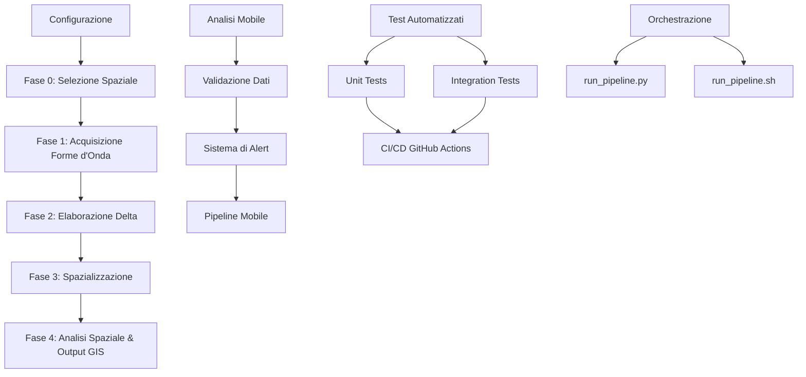
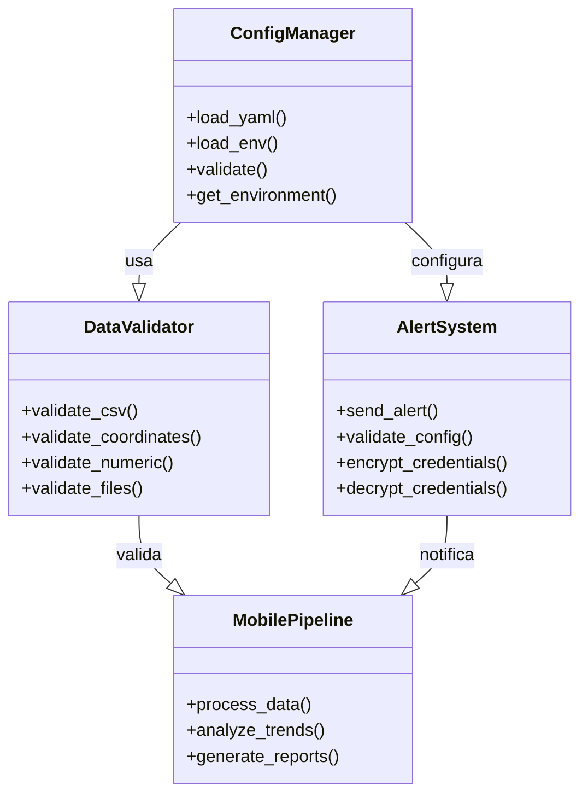

# Pipeline Sismologica Geospaziale

[](https://www.python.org/downloads/)
[](https://opensource.org/licenses/MIT)
[](https://github.com/psf/black)
[](https://github.com/pietroscik/Pipeline-Sismologica-Geospaziale/actions/workflows/test.yml)
[](https://github.com/pietroscik/Pipeline-Sismologica-Geospaziale)

Questa repository contiene una pipeline completa e configurabile in Python per scaricare, processare e analizzare spazialmente i dati sismici (forme d'onda e residui di tempi di arrivo, o *delta*).

Sviluppato originariamente per il monitoraggio dei **Campi Flegrei**, il codice e stato interamente generalizzato: modificando il file `config.yaml` e possibile applicare le stesse analisi geospaziali a **qualsiasi area del mondo**, rete sismica o catalogo eventi.

Il progetto genera output standard (statistiche e mappe) compatibili con i principali software GIS.

---

## Indice

- [Architettura del Progetto](#architettura-del-progetto)
- [Requisiti di Sistema](#requisiti-di-sistema)
- [Installazione](#installazione)
- [Configurazione](#configurazione)
- [Flusso di Lavoro (Pipeline)](#flusso-di-lavoro-pipeline)
- [Analisi Mobile](#analisi-mobile)
- [Orchestrazione ed Esecuzione](#orchestrazione-ed-esecuzione)
- [Interfaccia Web (Streamlit)](#globe_with_meridians-interfaccia-web-streamlit)
- [Struttura del Progetto](#struttura-del-progetto)
- [Esempi Legacy Integrati](#esempi-legacy-integrati)
- [Sviluppo](#sviluppo)
- [Changelog](#changelog)
- [Licenza](#licenza)

---

## Architettura del Progetto

### Diagramma Generale



### Componenti Principali



---

## Requisiti di Sistema

Per eseguire correttamente tutti gli script e necessario un ambiente Python 3.9+ configurato con le seguenti librerie:

### Dipendenze Principali

- `obspy>=1.4.0` - Accesso ai dati sismici FDSN
- `pandas>=2.0.0` - Manipolazione dati tabellari
- `geopandas>=0.12.0` - Analisi spaziale
- `rasterio>=1.3.0` - Gestione raster GIS
- `scipy>=1.10.0` - Calcoli scientifici
- `matplotlib>=3.7.0` - Visualizzazione
- `pyproj>=3.4.0` - Proiezioni geografiche
- `shapely>=2.0.0` - Operazioni geometriche
- `contextily>=1.3.0` - Basemap per mappe

### Dipendenze per lo Sviluppo

- `pytest>=7.4.0` - Framework di testing
- `pytest-cov>=4.1.0` - Copertura codice
- `black>=23.0.0` - Formattazione codice
- `flake8>=6.0.0` - Linting
- `mypy>=1.0.0` - Type checking (opzionale)

### Dipendenze per l'Interfaccia Web (Opzionali)

- `streamlit>=1.28.0` - Interfaccia web interattiva
- `folium>=0.14.0` - Mappe interattive
- `streamlit-folium>=0.11.0` - Integrazione Folium con Streamlit

---

## Installazione

### Metodo 1: Installazione in Modalita Sviluppo (Consigliato)

```bash
# Clona il repository
git clone https://github.com/pietroscik/Pipeline-Sismologica-Geospaziale.git
cd Pipeline-Sismologica-Geospaziale

# Crea un ambiente virtuale
git checkout -b dev
python -m venv venv
source venv/bin/activate  # Linux/Mac
# OR
venv\Scripts\activate  # Windows

# Installa le dipendenze principali
pip install -r requirements.txt

# Installa le dipendenze di test
pip install -r requirements-test.txt

# Installa il pacchetto in modalita editable
pip install -e .

# Verifica l'installazione
python -c "import pipeline_sismologica_geospaziale; print('Installazione completata!')"
```

### Metodo 2: Installazione con pip

```bash
pip install git+https://github.com/pietroscik/Pipeline-Sismologica-Geospaziale.git
```

### Metodo 3: Docker

```bash
# Build dell'immagine
docker build -t pipeline-sismologica .

# Esecuzione con volume montato per i risultati
docker run -it --rm \
  -v $(pwd)/runs:/app/runs \
  -v $(pwd)/data:/app/data \
  pipeline-sismologica
```

---

## Configurazione

### File di Configurazione Principale

Il file `config.yaml` contiene le impostazioni principali per la pipeline:

```yaml
# Configurazione FDSN
fdsn:
  client: "INGV"                    # Client FDSN (INGV, IRIS, etc.)
  networks: ["IV", "MN"]            # Reti sismiche
  start_date: "2024-01-01"          # Data inizio
  end_date: "2024-12-31"            # Data fine
  channels: ["HHZ", "HHN", "HHE"]   # Canali da scaricare

# Configurazione Spaziale
spatial:
  latitude: 40.82                   # Latitudine punto centrale
  longitude: 14.14                  # Longitudine punto centrale
  radius_km: 20.0                   # Raggio in km
  crs: "EPSG:32633"                 # Sistema di riferimento (UTM Zone 33N)

# Configurazione Elaborazione
processing:
  sample_rate: 50                   # Frequenza di campionamento
  filter_freq: [1.0, 10.0]          # Frequenze di taglio filtro
  sta_lta_window: [0.5, 10.0]       # Finestre STA/LTA
  min_stations: 10                 # Numero minimo stazioni
  min_events: 50                   # Numero minimo eventi

# Configurazione Output
output:
  runs_dir: "runs"                  # Directory output
  maps_dir: "maps"                  # Directory mappe
  export_geotiff: true              # Esporta GeoTIFF
  export_shapefile: true            # Esporta Shapefile
  export_csv: true                  # Esporta CSV
```

### Configurazione Sicura per il Sistema di Alert (Phase 4)

Il sistema di alert utilizza una configurazione **multi-ambiente** con supporto per l'**encryption** delle credenziali sensibili.

#### Struttura delle Configurazioni

```
mobile/config/
├── alert_config.yaml       # Configurazione base (default)
├── alert_config.dev.yaml   # Configurazione sviluppo
├── alert_config.prod.yaml  # Configurazione produzione  
└── alert_config.test.yaml  # Configurazione test
```

#### Variabili d'Ambiente

Copia il file `.env.example` in `.env` e personalizza i valori:

```bash
cp .env.example .env
```

```env
# ============================================
# AMBIENTE
# ============================================
ENVIRONMENT=dev

# ============================================
# ENCRYPTION
# ============================================
# Chiave per l'encryption delle credenziali (32 caratteri)
# Genera con: openssl rand -hex 32
ENCRYPTION_KEY=your_32_character_encryption_key_here

# ============================================
# FDSN
# ============================================
FDSN_CLIENT=INGV
FDSN_USER=
FDSN_PASSWORD=

# ============================================
# NOTIFICHE
# ============================================
# Slack
SLACK_WEBHOOK_URL=

# Email
EMAIL_SMTP_SERVER=smtp.gmail.com
EMAIL_SMTP_PORT=587
EMAIL_USERNAME=your_email@gmail.com
EMAIL_PASSWORD=your_app_password
EMAIL_FROM=your_email@gmail.com
EMAIL_TO=recipient@example.com

# Telegram
TELEGRAM_ENABLED=true
TELEGRAM_BOT_TOKEN=your_bot_token
TELEGRAM_CHAT_ID=your_chat_id

# ============================================
# SOGLIE DI ALERT
# ============================================
ALERT_THRESHOLD=5.0
ALERT_COOLDOWN_MINUTES=60
```

#### Esempio di Configurazione Alert (YAML)

```yaml
# mobile/config/alert_config.prod.yaml
environment: "prod"

notifications:
  slack:
    enabled: true
    webhook_url: "${SLACK_WEBHOOK_URL}"
    channel: "#sismic-alerts"
    
  email:
    enabled: true
    smtp_server: "${EMAIL_SMTP_SERVER}"
    smtp_port: ${EMAIL_SMTP_PORT}
    username: "${EMAIL_USERNAME}"
    password: "${EMAIL_PASSWORD}"
    from_addr: "${EMAIL_FROM}"
    to_addr: ["${EMAIL_TO}"]
    use_tls: true
  
  console:
    enabled: true
    level: "INFO"
    
  file:
    enabled: true
    path: "logs/alerts.log"
    level: "DEBUG"

thresholds:
  delta_seconds: 5.0
  delta_std_dev: 2.0
  cooldown_minutes: 60
  max_retries: 3

encryption:
  enabled: true
  key: "${ENCRYPTION_KEY}"
  algorithm: "AES"
```

#### Encryption delle Credenziali

Utilizza lo script `scripts/encrypt_credentials.py` per crittografare/decrittografare le credenziali:

```bash
# Crittografa una credenziale
python scripts/encrypt_credentials.py encrypt \
  --value "my_secret_password" \
  --key "$ENCRYPTION_KEY"

# Decripta una credenziale
python scripts/encrypt_credentials.py decrypt \
  --value "gAAAAAB..." \
  --key "$ENCRYPTION_KEY"

# Crittografa un file
python scripts/encrypt_credentials.py encrypt-file \
  --input credentials.txt \
  --output credentials.enc \
  --key "$ENCRYPTION_KEY"

# Decripta un file
python scripts/encrypt_credentials.py decrypt-file \
  --input credentials.enc \
  --output credentials.txt \
  --key "$ENCRYPTION_KEY"
```

#### Validazione della Configurazione

Il sistema valida automaticamente la configurazione all'avvio:

```python
from mobile.alert_system import AlertConfig, validate_config

# Carica e valida la configurazione
config = AlertConfig.from_yaml("mobile/config/alert_config.dev.yaml")
validation = validate_config(config)

if validation["valid"]:
    print("Configurazione valida!")
else:
    print(f"Errori: {validation['errors']}")
```

---

## Flusso di Lavoro (Pipeline)

La pipeline si divide in **4 fasi principali** piu una **Fase Mobile** introdotta in Phase 4.

### Fase 0: Selezione Spaziale (Opzionale)

**Script:** `scripts/select_stations_spatial.py`

Filtra il catalogo globale delle stazioni in base a un punto focale e un raggio o a un poligono personalizzato.

```bash
python scripts/select_stations_spatial.py \
  --input-csv examples/mobile_devices/stations.csv \
  --point 40.82 14.14 20.0 \
  --output-file runs/demo_legacy/selected_stations.txt

# Oppure con poligono da file GeoJSON
python scripts/select_stations_spatial.py \
  --input-csv examples/mobile_devices/stations.csv \
  --polygon examples/mobile_devices/area.geojson \
  --output-file runs/demo_legacy/selected_stations.txt
```

**Output:** File di testo con l'elenco delle stazioni selezionate.

---

### Fase 1: Acquisizione ed Esplorazione Forme d'Onda (FDSN)

**Script:** `scripts/download_cf_waveforms.py`

Interroga i server FDSN per scaricare massivamente le forme d'onda in formato MiniSEED.

```bash
# Scarica con configurazione da file
python scripts/download_cf_waveforms.py \
  --config config.yaml \
  --output-dir runs/demo/waveforms \
  --dry-run  # Modalita test: non scarica, solo mostra cosa verrebbe scaricato

# Scarica con parametri CLI
python scripts/download_cf_waveforms.py \
  --client INGV \
  --networks IV MN \
  --stations AQV BKE \
  --channels HHZ HHN HHE \
  --start-date 2024-01-01 \
  --end-date 2024-01-02 \
  --output-dir runs/demo/waveforms
```

**Script:** `scripts/analyze_trace.py`

Utility per l'ispezione di un singolo file traccia con analisi completa.

```bash
python scripts/analyze_trace.py \
  --input runs/demo/waveforms/IV.AQV..BHE.2024-01-01T00-00-00.mseed \
  --output runs/demo/analysis \
  --plot \
  --fft \
  --sta-lta

# Output:
# - Grafico della forma d'onda (PNG)
# - Spettro FFT (PNG)
# - Analisi STA/LTA (JSON)
# - Report completo (JSON)
```

---

### Fase 2: Elaborazione dei Tempi di Arrivo (Delta)

**Script:** `scripts/prepare_science_deltas.py`

Calcola lo scarto temporale (delta) per ciascuna traccia rispetto ad un riferimento temporale dell'evento.

```bash
python scripts/prepare_science_deltas.py \
  --events-catalog data/events.csv \
  --picks-catalog data/picks.csv \
  --output-csv runs/demo/deltas.csv \
  --reference median  # Oppure: mean, first

# Output: CSV con colonne:
# station, event_id, delta_seconds, channel, pick_time, expected_time
```

**Script:** `scripts/compute_mseed_deltas.py` *(Avanzato)*

Alternativa che legge direttamente le forme d'onda MiniSEED e calcola i delta applicando algoritmi di triggering.

```bash
python scripts/compute_mseed_deltas.py \
  --waveforms-dir runs/demo/waveforms \
  --output-csv runs/demo/deltas_from_waveforms.csv \
  --sta-window 0.5 \
  --lta-window 10.0 \
  --threshold 3.0
```

**Script:** `scripts/compute_station_stats.py`

Aggrega i delta per stazione e calcola statistiche (media, dev. standard, mediana, etc.).

```bash
python scripts/compute_station_stats.py \
  --base-csv runs/demo/deltas.csv \
  --output-csv runs/demo/station_stats.csv \
  --min-count 10 \
  --value-column delta_seconds

# Output: CSV con colonne:
# station, count, mean, std, min, max, median, q25, q75
```

---

### Fase 3: Spazializzazione del Dato Sismico

**Script:** `scripts/invert_station_locations.py` *(Avanzato)*

Ricalcola le coordinate ottimali (x, y) e le velocita per ogni stazione minimizzando i residui dei tempi di arrivo.

```bash
python scripts/invert_station_locations.py \
  --delta-csv runs/demo/deltas.csv \
  --stations-csv examples/mobile_devices/stations.csv \
  --output-csv runs/demo/inverted_locations.csv \
  --iterations 100 \
  --tolerance 0.001
```

**Script:** `scripts/export_missing_stations.py`

Recupera automaticamente le coordinate delle stazioni mancanti dal server FDSN.

```bash
python scripts/export_missing_stations.py \
  --delta-csv runs/demo/deltas.csv \
  --stations-csv examples/mobile_devices/stations.csv \
  --output-csv runs/demo/complete_stations.csv \
  --client INGV
```

**Script:** `scripts/attach_coords_to_deltas.py`

Unisce i valori statistici dei delta con le coordinate e riproietta in sistema metrico (UTM).

```bash
python scripts/attach_coords_to_deltas.py \
  --delta-csv runs/demo/station_stats.csv \
  --stations-csv examples/mobile_devices/stations.csv \
  --output-csv runs/demo/deltas_spatial.csv \
  --value-column base_mean \
  --target-crs EPSG:32633

# Output: CSV con colonne:
# station, lat, lon, elevation, x_utm, y_utm, mean_delta, std_delta, count
```

---

### Fase 4: Analisi Spaziale e Output GIS

**Script:** `scripts/analyze_delta_map.py`

Genera mappe termiche, scatter plot spaziali e output GIS compatibili con QGIS, ArcGIS, ecc.

```bash
python scripts/analyze_delta_map.py \
  --delta-csv runs/demo/deltas_spatial.csv \
  --outdir runs/demo/maps \
  --export-geotiff \
  --export-shapefile \
  --export-plot \
  --threshold 5.0 \
  --method cubic  # Oppure: linear, nearest

# Output:
# - delta_map.png (Mappa con scatter plot)
# - delta_heatmap.png (Mappa termica)
# - delta_contour.png (Mappe con isolinee)
# - anomalies.shp (Shapefile delle anomalie)
# - delta_surface.tif (GeoTIFF della superficie interpolata)
# - report.json (Report statistico)
```

---

## Analisi Mobile (NOVITA' PHASE 4)

La **Phase 4** ha introdotto un modulo completo per l'**analisi mobile** con:
- Validazione dati robusta
- Sistema di alert configurabile e sicuro
- Pipeline di analisi automatizzata
- Gestione errori avanzata

### Modulo: Validazione Dati (`mobile/data_validator.py`)

Fornisce funzioni di validazione comprehensive per tutti i tipi di dati sismici:

```python
from mobile.data_validator import (
    validate_csv_file,
    validate_csv_structure,
    validate_coordinates,
    validate_numeric_range,
    validate_file_exists,
    validate_file_extension,
    validate_directory,
    validate_path,
    validate_dataframe,
    validate_required_columns,
    validate_date_format,
    validate_time_format,
    validate_station_codes
)

# Esempio 1: Validazione file CSV
validate_csv_file(
    file_path="data/deltas.csv",
    required_columns=["station", "delta", "lat", "lon", "timestamp"],
    delimiter=",",
    encoding="utf-8"
)

# Esempio 2: Validazione coordinate geografiche
validate_coordinates(
    lat=40.82,
    lon=14.14,
    lat_range=(-90, 90),
    lon_range=(-180, 180),
    allow_nan=False
)

# Esempio 3: Validazione range numerico
validate_numeric_range(
    value=5.0,
    min_val=-10.0,
    max_val=10.0,
    inclusive=True
)

# Esempio 4: Validazione DataFrame
validate_dataframe(
    df=dataframe,
    required_columns=["station", "delta", "timestamp"],
    numeric_columns=["delta"],
    date_columns=["timestamp"],
    non_null_columns=["station"]
)
```

### Modulo: Sistema di Alert (`mobile/alert_system.py`)

Sistema di notifica flessibile e multi-canal con supporto per:
- **Slack** (Webhook)
- **Email** (SMTP con TLS)
- **Console** (Log strutturati)
- **File** (Log su file)

#### Esempio Completo

```python
from mobile.alert_system import AlertSystem, AlertConfig, AlertMessage

# Carica la configurazione dall'ambiente
config = AlertConfig.from_env()

# Oppure carica da file YAML
config = AlertConfig.from_yaml("mobile/config/alert_config.prod.yaml")

# Inizializza il sistema di alert
alert_system = AlertSystem(config)

# Crea un messaggio di alert
message = AlertMessage(
    title="Delta Anomalo Rilevato",
    message="La stazione AQV ha registrato un delta di 8.5 secondi",
    severity="high",  # low, medium, high, critical
    station="AQV",
    delta_value=8.5,
    timestamp=datetime.now().isoformat(),
    metadata={
        "event_id": "EVT_2024001",
        "network": "IV",
        "location": "Campi Flegrei"
    }
)

# Invia l'alert su tutti i canali abilitati
result = alert_system.send_alert(message)

# Invia a canale specifico
result = alert_system.send_alert(message, channel="slack")
result = alert_system.send_alert(message, channel="email")
```

#### Gestione degli Errori

```python
try:
    alert_system.send_alert(message)
except AlertError as e:
    print(f"Errore invio alert: {e}")
    # Gestione fallback
    alert_system.send_alert(message, channel="console")
except Exception as e:
    logger.error(f"Errore inaspettato: {e}", exc_info=True)
```

### Modulo: Pipeline di Analisi Mobile (`mobile/mobile_analysis_pipeline.py`)

Orchestra l'analisi completa dei dati mobili con:
- Validazione automatica input
- Elaborazione parallela
- Gestione timeout
- Cleanup automatico in caso di errore

#### Esempio di Utilizzo

```python
from mobile.mobile_analysis_pipeline import MobileAnalysisPipeline
from pathlib import Path

# Inizializza la pipeline
pipeline = MobileAnalysisPipeline(
    config_path="mobile/config/alert_config.dev.yaml",
    data_dir=Path("runs/demo/mobile"),
    timeout=3600,  # Timeout in secondi
    max_workers=4,  # Numero massimo di worker paralleli
    cleanup_on_error=True  # Pulisce i file temporanei in caso di errore
)

# Esecuzione completa
results = pipeline.run(
    input_csv="runs/demo/deltas_spatial.csv",
    output_dir="runs/demo/mobile/results",
    run_name="analysis_20240604"
)

# Esecuzione con validazione
results = pipeline.run_with_validation(
    input_csv="runs/demo/deltas_spatial.csv",
    output_dir="runs/demo/mobile/results",
    validate_input=True,
    validate_output=True,
    raise_on_validation_error=True
)

# Accesso ai risultati
print(f"Stazioni analizzate: {results['stations_count']}")
print(f"Eventi processati: {results['events_count']}")
print(f"Anomalie rilevate: {results['anomalies_count']}")
print(f"Tempo di esecuzione: {results['execution_time']:.2f} secondi")
```

#### Parametri di Configurazione

```python
# Configurazione avanzata
pipeline = MobileAnalysisPipeline(
    # Path
    config_path="mobile/config/alert_config.prod.yaml",
    data_dir=Path("/data/mobile"),
    temp_dir=Path("/tmp/pipeline"),
    
    # Prestazioni
    timeout=7200,
    max_workers=8,
    chunk_size=1000,
    
    # Validazione
    validate_input=True,
    validate_output=True,
    required_columns=["station", "delta", "lat", "lon", "timestamp"],
    
    # Alert
    send_alerts=True,
    alert_threshold=5.0,
    alert_cooldown=3600,  # secondi
    
    # Output
    export_csv=True,
    export_json=True,
    export_plots=True,
    overwrite=True,
    
    # Debug
    verbose=True,
    cleanup_on_error=True,
    log_level="INFO"
)
```

### Script di Esempio: Preparazione ML (`examples/mobile_devices/prepara_ml.py`)

Prepara il dataset per il Machine Learning con validazione integrata:

```bash
python examples/mobile_devices/prepara_ml.py \
  --input data/deltas.csv \
  --output data/ml_dataset.csv \
  --target-column delta \
  --test-size 0.2 \
  --random-state 42 \
  --validate

# Opzioni:
# --input: File CSV di input
# --output: File CSV di output
# --target-column: Colonna target per il ML
# --test-size: Proporzione dataset di test (0.0-1.0)
# --random-state: Seed per la riproducibilita
# --validate: Esegue validazione dei dati
# --feature-columns: Colonne da usare come feature
# --drop-na: Elimina righe con valori mancanti
# --normalize: Normalizza le feature
```

### Script di Esempio: Addestramento Modello (`examples/mobile_devices/train_modello.py`)

Addestra un modello di previsione dei delta:

```bash
python examples/mobile_devices/train_modello.py \
  --dataset data/ml_dataset.csv \
  --model-output models/delta_predictor.pkl \
  --model-type xgboost  # Oppure: random_forest, linear, neural
  --epochs 100 \
  --batch-size 32 \
  --learning-rate 0.01 \
  --early-stopping 10 \
  --validate

# Opzioni:
# --dataset: Dataset di input
# --model-output: Path per salvare il modello
# --model-type: Tipo di modello (xgboost, random_forest, linear, neural)
# --epochs: Numero di epoche
# --batch-size: Dimensione batch
# --learning-rate: Tasso di apprendimento
# --early-stopping: Pazienza per early stopping
# --validate: Esegue validazione incrociata
# --test-size: Dimensione test set
```

---

## Orchestrazione ed Esecuzione

Il progetto supporta esecuzioni **isolate** tramite "Run Directory". Ogni esecuzione crea automaticamente una cartella dedicata sotto `runs/<NOME_RUN>/` per evitare sovrascritture.

### Orchestratore Python (`run_pipeline.py`)

```bash
# Esecuzione standard (nome automatico con timestamp)
python run_pipeline.py

# Esecuzione con nome personalizzato
python run_pipeline.py --run-name flegrei_2026_06_04

# Esecuzione con dataset dimostrativo
python run_pipeline.py \
  --run-name demo_legacy \
  --start-phase 0 \
  --end-phase 4 \
  --delta-csv examples/mobile_devices/scoperte_automatiche.csv.gz \
  --stations-csv examples/mobile_devices/stations.csv

# Esecuzione con configurazione personalizzata
python run_pipeline.py \
  --run-name custom_run \
  --config custom_config.yaml \
  --timeout 7200 \
  --cleanup
```

#### Opzioni dell'Orchestratore

| Opzione | Descrizione | Default | Esempio |
|---------|-------------|---------|---------|
| `--run-name` | Nome univoco della run | Timestamp | `--run-name my_analysis` |
| `--start-phase` | Fase di partenza (0-4) | 0 | `--start-phase 2` |
| `--end-phase` | Fase finale (0-4) | 4 | `--end-phase 3` |
| `--config` | File di configurazione | `config.yaml` | `--config my_config.yaml` |
| `--delta-csv` | File CSV con i delta | - | `--delta-csv data/deltas.csv` |
| `--stations-csv` | File CSV con le stazioni | - | `--stations-csv data/stations.csv` |
| `--output-dir` | Directory output | `runs/<run-name>/` | `--output-dir my_output/` |
| `--timeout` | Timeout in secondi | 3600 | `--timeout 7200` |
| `--dry-run` | Modalita test (no download) | False | `--dry-run` |
| `--cleanup` | Pulizia file temporanei | True | `--cleanup` |
| `--verbose` | Output dettagliato | False | `--verbose` |
| `--log-level` | Livello di logging | INFO | `--log-level DEBUG` |

### Orchestratore Bash (`run_pipeline.sh`)

```bash
# Esegui l'intera pipeline
bash run_pipeline.sh

# Esegui con nome personalizzato
bash run_pipeline.sh flegrei_2026_06_04

# Esegui solo alcune fasi
bash run_pipeline.sh custom_run 1 3  # Fasi 1-3
```

### Esecuzione Manuale dei Singoli Script

Per chi preferisce il controllo completo su ogni fase:

```bash
# 0. Selezione spaziale
echo "=== Fase 0: Selezione Stazioni ==="
python scripts/select_stations_spatial.py \
  --input-csv examples/mobile_devices/stations.csv \
  --point 40.82 14.14 20.0 \
  --output-file runs/demo/selected_stations.txt

# 1. Download forme d'onda
echo "=== Fase 1: Download Dati ==="
python scripts/download_cf_waveforms.py \
  --config config.yaml \
  --output-dir runs/demo/waveforms \
  --stations-file runs/demo/selected_stations.txt

# 2. Calcolo statistiche
echo "=== Fase 2: Elaborazione ==="
python scripts/compute_station_stats.py \
  --base-csv runs/demo/deltas.csv \
  --output-csv runs/demo/station_stats.csv \
  --min-count 10

# 3. Spazializzazione
echo "=== Fase 3: Spazializzazione ==="
python scripts/attach_coords_to_deltas.py \
  --delta-csv runs/demo/station_stats.csv \
  --stations-csv examples/mobile_devices/stations.csv \
  --output-csv runs/demo/deltas_spatial.csv \
  --value-column base_mean

# 4. Analisi spaziale
echo "=== Fase 4: Output GIS ==="
python scripts/analyze_delta_map.py \
  --delta-csv runs/demo/deltas_spatial.csv \
  --outdir runs/demo/maps \
  --export-geotiff \
  --export-shapefile \
  --threshold 5.0
```

---

## :globe_with_meridians: Interfaccia Web (Streamlit)

Il progetto include un'**interfaccia web interattiva** basata su Streamlit che semplifica l'esecuzione della pipeline e la visualizzazione dei risultati.

### Avvio Rapido

```bash
# Installa le dipendenze aggiuntive
pip install streamlit folium streamlit-folium

# Avvia l'interfaccia
streamlit run app.py

# Oppure con configurazione specifica
streamlit run app.py -- --config config.yaml
```

L'interfaccia sara accessibile all'indirizzo: [http://localhost:8501](http://localhost:8501)

### Funzionalita dell'Interfaccia

- **Configurazione Interattiva**: Imposta nome run, coordinate, raggio, date, reti sismiche
- **Esecuzione Automatica**: Avvia l'intera pipeline con un click
- **Monitoraggio in Tempo Reale**: Visualizza lo stato di avanzamento
- **Mappa Interattiva**: 
  - Basemap: CartoDB, Esri Satellite, OpenStreetMap
  - HeatMap dei ritardi sismici
  - Marker delle stazioni
  - Filtri dinamici per delta e nome stazione
- **Tabella Dati Interattiva**: Filtra, ordina, esporta i dati
- **Download Risultati**: Esportazione ZIP di tutti i risultati
- **Visualizzazione Grafici**: Grafici dei delta per stazione

### Screenshot delle Funzionalita

```
+--------------------------------------------------+
|  Pipeline Sismologica Geospaziale               |
+--------------------------------------------------+
|                                                  |
|  [Configurazione] [Esecuzione] [Risultati]       |
|                                                  |
|  Nome Run: [flegrei_2026_06_04_______]           |
|  Latitudine:  [40.82________]                   |
|  Longitudine: [14.14________]                   |
|  Raggio (km):  [20__________]                    |
|  Data Inizio:  [2024-01-01____]                  |
|  Data Fine:    [2024-06-04____]                  |
|                                                  |
|  [AVVIA PIPELINE]                                 |
|                                                  |
+--------------------------------------------------+
```

---

## Struttura del Progetto

```
Pipeline-Sismologica-Geospaziale/
├── .editorconfig                    # Configurazione editor
├── .env.example                     # Template variabili ambiente
├── .gitignore                       # File ignorati da Git
├── CHANGELOG.md                     # Changelog del progetto
├── LICENSE                          # Licenza MIT
├── README.md                        # Documentazione (questo file)
├── app.py                           # Interfaccia Streamlit
├── config.yaml                      # Configurazione principale
├── path_utils.py                    # Utilita path resolution
├── pyproject.toml                   # Configurazione pacchetto PEP 621
├── requirements.txt                 # Dipendenze principali
├── requirements-test.txt            # Dipendenze di test
├── run_pipeline.py                  # Orchestratore Python
├── run_pipeline.sh                  # Orchestratore Bash
├── setup.cfg                        # Configurazione pytest
├── setup.py                         # Setup pacchetto
├── pytest.ini                       # Configurazione pytest
│
├── .github/
│   └── workflows/
│       └── test.yml                 # CI/CD GitHub Actions
│
├── examples/
│   └── mobile_devices/              # Dataset e script dimostrativi
│       ├── README.md
│       ├── scoperte_automatiche.csv.gz     # Dataset dimostrativo
│       ├── stations.csv                    # Coordinate stazioni
│       ├── analisi_propagazione.py
│       ├── analizza.py
│       ├── analizza_trend.py
│       ├── associa_eventi.py
│       ├── calcolo_bvalue.py
│       ├── confronto_fasi.py
│       ├── download_seeds.py
│       ├── grafico_energia.py
│       ├── grafico_stazioni.py
│       ├── mappa_epicentrici.py
│       ├── moran_sismico.py
│       ├── prepara_ml.py               # Preparazione ML (Phase 4)
│       ├── process_pipeline.py
│       ├── train_modello.py             # Addestramento modello (Phase 4)
│       └── ...
│
├── mobile/                           # Modulo Analisi Mobile (Phase 4)
│   ├── __init__.py
│   ├── alert_system.py              # Sistema di alert
│   ├── data_validator.py            # Validazione dati
│   ├── logging_config.py            # Configurazione logging
│   ├── mobile_analysis_pipeline.py   # Pipeline mobile
│   └── config/
│       ├── __init__.py
│       ├── alert_config.yaml         # Configurazione base
│       ├── alert_config.dev.yaml     # Configurazione sviluppo
│       ├── alert_config.prod.yaml    # Configurazione produzione
│       └── alert_config.test.yaml    # Configurazione test
│
├── runs/                            # Output delle esecuzioni (generato)
│   └── <run_name>/
│       ├── logs/
│       ├── maps/
│       ├── processed/
│       └── waveforms/
│
├── scripts/                         # Script principali
│   ├── __init__.py
│   ├── utils.py                     # Utilita condivise
│   ├── test_workflow.py             # Test workflow (Issue #3)
│   ├── analyze_delta_map.py
│   ├── analyze_trace.py
│   ├── attach_coords_to_deltas.py
│   ├── compute_mseed_deltas.py
│   ├── compute_station_stats.py
│   ├── download_cf_waveforms.py
│   ├── encrypt_credentials.py        # Encryption credenziali (Issue #21)
│   ├── export_all_stations.py
│   ├── export_missing_stations.py
│   ├── export_station_csv.py
│   ├── invert_station_locations.py
│   ├── prepare_science_deltas.py
│   ├── select_stations_spatial.py
│   └── view_delta_maps.py
│
└── tests/                           # Test automatizzati (Issue #18)
    ├── __init__.py
    ├── conftest.py                  # Fixtures pytest
    ├── test_utils.py
    ├── mobile/
    │   ├── __init__.py
    │   ├── test_data_validator.py    # Test validazione dati
    │   └── test_alert_system.py      # Test sistema alert
    └── integration/
        ├── __init__.py
        └── test_pipeline.py          # Test integrazione pipeline
```

---

## Esempi Legacy Integrati

Il progetto include un **dataset dimostrativo** e script esplorativi storici in `examples/mobile_devices/`.

### Contenuto della Cartella

- **Dataset Pronti all'Uso**:
  - `scoperte_automatiche.csv.gz` - Input già pronto per la pipeline
  - `stations.csv` - Coordinate delle stazioni del Campi Flegrei
  - `catalogo_terremoti_unici.csv` - Catalogo eventi
  - `output_eventi_georeferenziati.csv.gz` - Eventi georeferenziati
  - `soli_epicentri_terremoti.geojson` - Epicentri in GeoJSON

- **Script di Analisi**:
  - `analisi_propagazione.py` - Analisi propagazione onde
  - `analizza.py` - Analisi esplorativa
  - `analizza_trend.py` - Analisi trend temporali
  - `associa_eventi.py` - Associazione eventi
  - `calcolo_bvalue.py` - Calcolo parametro b-value
  - `confronto_fasi.py` - Confronto tra fasi
  - `download_seeds.py` - Download dati SEED
  - `grafico_energia.py` - Grafici energia
  - `grafico_stazioni.py` - Grafici stazioni
  - `mappa_epicentrici.py` - Mappe epicentri
  - `moran_sismico.py` - Analisi spaziale Moran's I

- **Report**:
  - `report_scoperte.xlsx` - Report Excel
  - `report_sismico_aggregato.xlsx` - Report aggregato

### Utilizzo

Questa cartella **non sostituisce** la pipeline principale, ma fornisce:
1. Un riferimento pratico per testare la pipeline con dati reali
2. Esempi di analisi avanzate
3. Dataset pronti per l'interfaccia Streamlit

```bash
# Esegui la pipeline con i dati dimostrativi
python run_pipeline.py \
  --run-name demo_legacy \
  --delta-csv examples/mobile_devices/scoperte_automatiche.csv.gz \
  --stations-csv examples/mobile_devices/stations.csv

# Esegui l'interfaccia Streamlit con i dati dimostrativi
streamlit run app.py
```

---

## Sviluppo

### Prerequisiti per lo Sviluppo

```bash
# Clona il repository
git clone https://github.com/pietroscik/Pipeline-Sismologica-Geospaziale.git
cd Pipeline-Sismologica-Geospaziale

# Crea ambiente virtuale
python -m venv venv
source venv/bin/activate

# Installa tutte le dipendenze
pip install -r requirements.txt
pip install -r requirements-test.txt
pip install -e .
```

### Esecuzione dei Test

```bash
# Esegui tutti i test
pytest

# Esegui con coverage e report HTML
pytest --cov=./ --cov-report=html --cov-report=term-missing

# Esegui test specifici
pytest tests/mobile/test_data_validator.py -v
pytest tests/mobile/test_alert_system.py -v
pytest tests/integration/test_pipeline.py -v

# Esegui con output verboso
pytest -v

# Esegui con marker specifici
pytest -m slow
pytest -m integration
pytest -m "not slow"

# Esegui solo i test che sono falliti
pytest --last-failed
```

### Configurazione dei Test

Il file `pytest.ini` contiene la configurazione predefinita:

```ini
[pytest]
testpaths = tests
python_files = test_*.py
python_classes = Test*
python_functions = test_*
addopts = -v --tb=short --cov=./ --cov-report=term-missing --cov-report=html --cov-fail-under=80

markers =
    slow: marks tests as slow (deselect with '-m "not slow"')
    integration: marks integration tests
    unit: marks unit tests
```

Per **disabilitare temporaneamente** il controllo di coverage:
```bash
pytest --no-cov
```

### CI/CD con GitHub Actions

Il workflow `.github/workflows/test.yml` esegue automaticamente i test su ogni push e pull request:

```yaml
name: Test Pipeline

on:
  push:
    branches: [main]
  pull_request:
    branches: [main]

jobs:
  test:
    runs-on: ubuntu-latest
    steps:
      - uses: actions/checkout@v4
      
      - name: Set up Python
        uses: actions/setup-python@v5
        with:
          python-version: "3.10"
      
      - name: Install dependencies
        run: |
          python -m pip install --upgrade pip
          pip install -r requirements.txt
          pip install -r requirements-test.txt
          pip install -e .
      
      - name: Lint with flake8
        run: |
          pip install flake8
          flake8 . --count --select=E9,F63,F7,F82 --show-source --statistics
      
      - name: Test with pytest and coverage
        run: |
          pytest tests/ -v --tb=short --cov=./ --cov-report=xml --cov-report=html --cov-fail-under=80
      
      - name: Upload coverage to Codecov
        uses: codecov/codecov-action@v3
        with:
          files: ./coverage.xml
          fail_ci_if_error: true
```

**Badges Disponibili**:
- Tests: ``
- Coverage: `` (dopo configurazione Codecov)

### Standard di Codice

Il progetto utilizza i seguenti standard:

#### Formattazione
- **Black**: Line length = 88 caratteri
- **Isort**: Ordinamento import automatico

```bash
# Formattazione automatica di tutto il progetto
black .
isort .

# Formattazione di un file specifico
black scripts/analyze_delta_map.py
```

#### Linting
- **Flake8**: Controllo errori di sintassi e stile

```bash
flake8 . --count --select=E9,F63,F7,F82 --show-source --statistics
```

#### Type Checking (Opzionale)
- **mypy**: Controllo tipi statico

```bash
mypy . --ignore-missing-imports
```

#### Pre-commit Hooks

Configura i ganci Git per l'esecuzione automatica:

```bash
# Installa pre-commit
pip install pre-commit

# Installa i ganci
pre-commit install

# Esegui manualmente su tutti i file
pre-commit run --all-files
```

Creare il file `.pre-commit-config.yaml`:

```yaml
repos:
  - repo: https://github.com/psf/black
    rev: 23.12.0
    hooks:
      - id: black
        language_version: python3
  - repo: https://github.com/pycqa/flake8
    rev: 6.1.0
    hooks:
      - id: flake8
  - repo: https://github.com/pycqa/isort
    rev: 5.13.2
    hooks:
      - id: isort
        args: ["--profile", "black"]
```

### Path Resolution

**Tutti gli script devono usare** `get_project_root()` da `scripts/utils.py` per la risoluzione dei path:

```python
from pathlib import Path
from scripts.utils import get_project_root

# Ottieni la root del progetto (funziona da qualsiasi directory)
PROJECT_ROOT = get_project_root()

# Costruisci path assoluti
config_path = PROJECT_ROOT / "config.yaml"
data_dir = PROJECT_ROOT / "runs" / "demo" / "data"
output_file = PROJECT_ROOT / "runs" / "demo" / "results" / "output.csv"

# Funzione di utilita per risolvere path relativi
def resolve_path(relative_path: str) -> Path:
    return PROJECT_ROOT / relative_path
```

La funzione `get_project_root()`:
- Trova automaticamente la root del progetto
- Funziona indipendentemente dalla directory di lavoro corrente
- Utilizza `__file__` per determinare il path assoluto
- Crea un oggetto `Path` di pathlib

### Gestione degli Errori e Robustezza (Phase 4)

La pipeline implementa una gestione **robusta** degli errori con:

#### Timeout Configurabili

```python
import signal
from contextlib import timeout

# Timeout di 30 secondi per un'operazione
try:
    with timeout(30):
        process_data()
except TimeoutError:
    logger.error("Operazione timeout dopo 30 secondi")
    cleanup_resources()
```

#### Validazione dei Dati in Input

```python
from mobile.data_validator import validate_csv_file, ValidationError

try:
    validate_csv_file(
        "data/deltas.csv",
        required_columns=["station", "delta", "lat", "lon"],
        delimiter=","
    )
except ValidationError as e:
    logger.error(f"Validazione fallita: {e}")
    raise
```

#### Cleanup Automatico in Caso di Errore

```python
import tempfile
import shutil
from pathlib import Path

class PipelineError(Exception):
    pass

def run_pipeline():
    temp_dir = Path(tempfile.mkdtemp())
    try:
        # Elaborazione...
        process_data(temp_dir)
    except Exception as e:
        # Pulizia automatica
        shutil.rmtree(temp_dir, ignore_errors=True)
        raise PipelineError(f"Errore nella pipeline: {e}") from e
```

#### Messaggi di Errore Dettagliati

```python
import logging
from scripts.utils import setup_logging

logger = setup_logging(__name__)

try:
    result = risky_operation()
except Exception as e:
    logger.error(
        f"Operazione fallita: {e}",
        exc_info=True,  # Includi traceback
        extra={
            "context": {
                "function": "risky_operation",
                "input": input_data,
                "timestamp": datetime.now().isoformat()
            }
        }
    )
    raise
```

#### Logging Strutturato

```python
# Configurazione logging (scripts/utils.py)
import logging
import sys
from pathlib import Path

def setup_logging(name: str, level: str = "INFO") -> logging.Logger:
    logger = logging.getLogger(name)
    logger.setLevel(getattr(logging, level.upper()))
    
    # Handler console
    console_handler = logging.StreamHandler(sys.stdout)
    console_handler.setLevel(logging.INFO)
    console_handler.setFormatter(logging.Formatter(
        '%(asctime)s - %(name)s - %(levelname)s - %(message)s'
    ))
    
    # Handler file
    log_dir = Path("logs")
    log_dir.mkdir(exist_ok=True)
    file_handler = logging.FileHandler(log_dir / f"{name}.log")
    file_handler.setLevel(logging.DEBUG)
    file_handler.setFormatter(logging.Formatter(
        '%(asctime)s - %(name)s - %(levelname)s - %(message)s'
    ))
    
    logger.addHandler(console_handler)
    logger.addHandler(file_handler)
    
    return logger
```

---

## Changelog

Per il changelog dettagliato, vedere [CHANGELOG.md](CHANGELOG.md).

### Novita della Phase 4 (Giugno 2026)

La **Phase 4** ha introdotto miglioramenti significativi in termini di **robustezza, sicurezza, testing e documentazione**:

| Issue | Titolo | Descrizione |
|-------|--------|-------------|
| #10 | Risolvi dipendenze tra script e path resolution | Implementato `get_project_root()` in tutti gli script per path resolution centralizzato. Tutti gli script ora funzionano indipendentemente dalla directory di lavoro. |
| #21 | Configurazione Sicura Alert System | Sistema di alert multi-ambiente con supporto encryption delle credenziali. Configurazioni separate per dev, test, prod. Variabili d'ambiente con precedenza su YAML. |
| #20 | Robustezza Pipeline: Validazione + Gestione Errori | Aggiunta validazione dati in tutti i componenti. Timeout configurabili. Cleanup automatico in caso di errore. Messaggi di errore dettagliati. Logging strutturato. |
| #3 | Test workflow completo con analisi mobile | Creato `scripts/test_workflow.py` per validare l'intero workflow. Test di validazione e integrazione. |
| #18 | Test automatizzati per analisi mobile | Creata struttura completa di test: unit test, integration test, fixtures. Configurato pytest con coverage. CI/CD con GitHub Actions. |
| #8 | Aggiorna documentazione con analisi mobile | **Documentazione completa aggiornata** con: architettura, installazione, configurazione, analisi mobile, sviluppo, CI/CD. |

### Roadmap Futura

- [ ] **Phase 5**: 
  - Dashboard interattiva con Plotly Dash
  - Integrazione con database PostgreSQL/PostGIS
  - API REST per accesso remoto
  - Deploy automatico su cloud

---

## Licenza

Questo progetto e distribuito con licenza **MIT**. Vedere [LICENSE](LICENSE) per i dettagli.

```
MIT License

Copyright (c) 2026 Pietro Maietta

Permission is hereby granted, free of charge, to any person obtaining a copy
of this software and associated documentation files (the "Software"), to deal
in the Software without restriction, including without limitation the rights
to use, copy, modify, merge, publish, distribute, sublicense, and/or sell
copies of the Software, and to permit persons to whom the Software is
furnished to do so, subject to the following conditions:

The above copyright notice and this permission notice shall be included in all
copies or substantial portions of the Software.

THE SOFTWARE IS PROVIDED "AS IS", WITHOUT WARRANTY OF ANY KIND, EXPRESS OR
IMPLIED, INCLUDING BUT NOT LIMITED TO THE WARRANTIES OF MERCHANTABILITY,
FITNESS FOR A PARTICULAR PURPOSE AND NONINFRINGEMENT. IN NO EVENT SHALL THE
AUTHORS OR COPYRIGHT HOLDERS BE LIABLE FOR ANY CLAIM, DAMAGES OR OTHER
LIABILITY, WHETHER IN AN ACTION OF CONTRACT, TORT OR OTHERWISE, ARISING FROM,
OUT OF OR IN CONNECTION WITH THE SOFTWARE OR THE USE OR OTHER DEALINGS IN THE
SOFTWARE.
```

---

## Contatti

Per domande, suggerimenti o collaborazioni:

- **Autore**: Pietro Maietta
- **GitHub**: [pietroscik](https://github.com/pietroscik)
- **Repository**: [Pipeline-Sismologica-Geospaziale](https://github.com/pietroscik/Pipeline-Sismologica-Geospaziale)
- **Email**: pietroscik@gmail.com

### Come Contribuire

1. Fork il repository
2. Crea un branch per la tua feature (`git checkout -b feature/nome-feature`)
3. Committa le tue modifiche (`git commit -m 'Aggiunta nuova feature'`)
4. Push sul branch (`git push origin feature/nome-feature`)
5. Apri una Pull Request

---

## Appendice

### Glossario

| Termine | Descrizione |
|---------|-------------|
| **Delta** | Scarto temporale dell'arrivo di un'onda sismica rispetto ad un riferimento |
| **FDSN** | Federation of Digital Seismograph Networks - Standard per accesso dati sismici |
| **StationXML** | Formato XML per metadati delle stazioni sismiche |
| **MiniSEED** | Formato binario per forme d'onda sismiche |
| **UTM** | Universal Transverse Mercator - Sistema di coordinate proiettate |
| **EPSG** | European Petroleum Survey Group - Codici per sistemi di riferimento |
| **STA/LTA** | Short-Time Average / Long-Time Average - Algoritmo di triggering |

### Riferimenti Utili

- [ObsPy Documentation](https://docs.obspy.org/)
- [FDSN Web Services](https://www.fdsn.org/webservices/)
- [GeoPandas Documentation](https://geopandas.org/)
- [PyProj Documentation](https://pyproj4.github.io/pyproj/stable/)
- [Pytest Documentation](https://docs.pytest.org/)
- [GitHub Actions](https://docs.github.com/en/actions)

---

*Documentazione aggiornata al: 4 Giugno 2026*
*Versione: 1.0.0 (Phase 4 Complete)*
