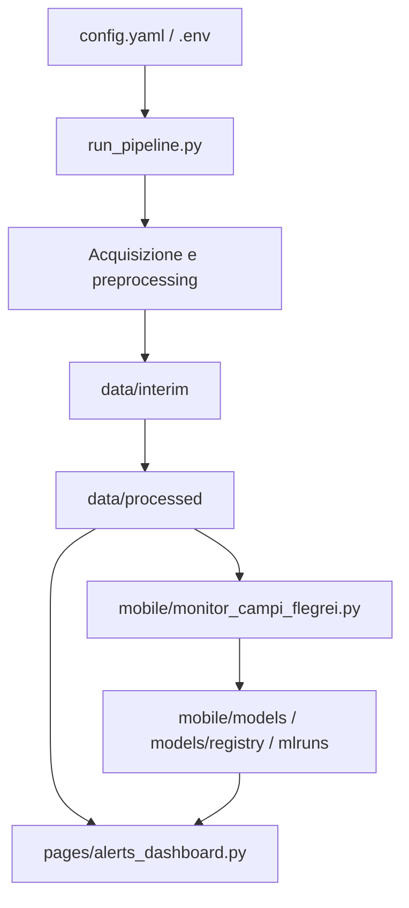

# Pipeline Sismologica Geospaziale

[](https://www.python.org/downloads/)
[](https://opensource.org/licenses/MIT)
[](https://github.com/psf/black)
[](https://github.com/pietroscik/Pipeline-Sismologica-Geospaziale/actions/workflows/test.yml)

Questa repository contiene una pipeline in Python per acquisire, processare, versionare e analizzare dati sismologici, con particolare attenzione al contesto dei **Campi Flegrei**.

La struttura è stata generalizzata per lavorare con diverse aree geografiche e diverse reti sismiche, mantenendo un flusso univoco:

**`run_pipeline.py` → `mobile/monitor_campi_flegrei.py` → `data/` e `runs/` → `pages/alerts_dashboard.py`**

Il progetto produce output tabellari e cartografici compatibili con flussi GIS e con analisi operative su dashboard Streamlit.

## Indice

- [Architettura del Progetto](#architettura-del-progetto)
- [Requisiti di Sistema](#requisiti-di-sistema)
- [Installazione](#installazione)
- [Configurazione](#configurazione)
- [Flusso di Lavoro](#flusso-di-lavoro)
- [Analisi Mobile](#analisi-mobile)
- [Orchestrazione ed Esecuzione](#orchestrazione-ed-esecuzione)
- [Interfaccia Web (Streamlit)](#interfaccia-web-streamlit)
- [Struttura del Progetto](#struttura-del-progetto)
- [Dataset ed Esempi](#dataset-ed-esempi)
- [Obiettivi e Scope](#obiettivi-e-scope)
- [Data Contract](#data-contract)
- [Model Governance](#model-governance)
- [Qualità e Testing](#qualità-e-testing)
- [Runbook Operativo e Troubleshooting](#runbook-operativo-e-troubleshooting)
- [Sicurezza e Configurazione Sensibile](#sicurezza-e-configurazione-sensibile)
- [Sviluppo](#sviluppo)
- [Changelog](#changelog)
- [Licenza](#licenza)

## Architettura del Progetto

### Flusso logico



### Componenti principali

- `run_pipeline.py`: orchestrazione delle fasi
- `scripts/`: utility, analisi e generazione di mappe
- `mobile/`: training, monitoring, validazione, versioning
- `pages/alerts_dashboard.py`: visualizzazione Streamlit
- `data/`: input, intermedi e output canonici
- `runs/`: esecuzioni storiche e artefatti di run
- `mlruns/`: tracking MLflow

## Requisiti di Sistema

- Python 3.9 o superiore
- Windows 10/11 oppure ambiente Linux equivalente
- Git
- Ambiente virtuale Python
- Dipendenze scientifiche e geospaziali installate tramite `requirements.txt`

## Installazione

### Ambiente di sviluppo

```powershell
git clone https://github.com/pietroscik/Pipeline-Sismologica-Geospaziale.git
cd Pipeline-Sismologica-Geospaziale
python -m venv venv
.\venv\Scripts\activate
pip install -r requirements.txt
pip install -r requirements-test.txt
pip install -e .
```

### Verifica

```powershell
pytest
```

### Avvio dashboard

```powershell
streamlit run .\pages\alerts_dashboard.py
```

## Configurazione

### File principali

- `config.yaml`: configurazione generale della pipeline
- `.env`: variabili d’ambiente locali
- `.env.example`: template sicuro
- `mobile/config/*.yaml`: configurazioni del sistema mobile, monitor e alert

### Directory principali

- `data/raw/`: input grezzi
- `data/interim/`: output intermedi
- `data/processed/`: output finali
- `runs/`: run storiche
- `mobile/models/`: modelli locali versionati
- `models/registry/`: manifest di registry
- `mlruns/`: tracking MLflow

### Nota operativa

La dashboard Streamlit legge i dati realmente prodotti dalla pipeline.  
Se non esiste un dataset di alert dedicato, la vista allarmi va considerata informativa e non un sistema di alert operativo.

## Flusso di Lavoro

### Fase 0: Selezione spaziale
`scripts/select_stations_spatial.py`

### Fase 1: Acquisizione waveform
`scripts/download_cf_waveforms.py`

### Fase 2: Calcolo delta e statistiche
`scripts/compute_mseed_deltas.py`  
`scripts/compute_station_stats.py`  
`scripts/prepare_science_deltas.py`

### Fase 3: Associazione coordinate e spazializzazione
`scripts/attach_coords_to_deltas.py`  
`scripts/export_missing_stations.py`  
`scripts/invert_station_locations.py`

### Fase 4: Analisi spaziale e mappe
`scripts/analyze_delta_map.py`  
`scripts/view_delta_maps.py`

### Output canonici

- `data/interim/scoperte_automatiche.csv`
- `data/interim/station_deltas.csv`
- `data/processed/deltas_spatial.csv`
- `data/processed/station_stats.csv`
- `data/processed/mappa_scoperte.csv`
- `data/processed/stats_scoperte.csv`

## Analisi Mobile

Il modulo `mobile/` gestisce:

- validazione dati
- monitoring
- alerting
- training del modello rischio
- versioning locale e tracking MLflow

### Componenti principali

- `mobile/data_validator.py`
- `mobile/alert_system.py`
- `mobile/monitor_campi_flegrei.py`
- `mobile/train_risk_model.py`
- `mobile/model_versioning.py`

### Output attesi

- `mobile/models/random_forest/*`
- `models/registry/*.json`
- `mlruns/`
- `mobile/alerts/alerts_log.csv`
- `mobile/alerts/alerts_log.jsonl`

## Orchestrazione ed Esecuzione

### Esecuzione pipeline

```powershell
python run_pipeline.py
```

### Monitoring

```powershell
python -m mobile.monitor_campi_flegrei
```

### Training modello rischio

```powershell
python -m mobile.train_risk_model --force
```

### Dashboard

```powershell
streamlit run .\pages\alerts_dashboard.py
```

## Interfaccia Web (Streamlit)

L’interfaccia Streamlit consente di:

- visualizzare i dati di monitoraggio
- ispezionare le statistiche di stazione
- consultare la mappa spaziale
- analizzare gli output disponibili
- esportare i risultati disponibili

### Avvio

```powershell
streamlit run .\pages\alerts_dashboard.py
```

### Nota

La dashboard mostra i dati disponibili nei file prodotti dalla pipeline.  
La sezione allarmi ha valore operativo solo se esiste un feed di alert dedicato.

## Struttura del Progetto

```text
Pipeline-Sismologica-Geospaziale/
├── app.py
├── config.yaml
├── data/
│   ├── raw/
│   ├── interim/
│   └── processed/
├── examples/
│   └── mobile_devices/
├── mobile/
│   ├── alert_system.py
│   ├── data_validator.py
│   ├── model_versioning.py
│   ├── monitor_campi_flegrei.py
│   └── train_risk_model.py
├── models/
│   └── registry/
├── pages/
│   └── alerts_dashboard.py
├── runs/
├── scripts/
├── tests/
├── mlruns/
├── path_utils.py
├── run_pipeline.py
├── requirements.txt
├── requirements-test.txt
├── pyproject.toml
└── README.md
```

## Dataset ed Esempi

La cartella `examples/mobile_devices/` contiene:

- dataset dimostrativi
- script di analisi storici
- file di supporto per test e prototipi

Questi file sono utili per esplorazione e validazione, ma non sostituiscono gli output canonici della pipeline in `data/processed/` e `runs/`.

## Obiettivi e Scope

### Obiettivi principali

- automatizzare il processing sismologico su batch/runs
- produrre output tabellari e mappe geospaziali riproducibili
- supportare monitoraggio operativo con dashboard Streamlit
- versionare e tracciare i modelli di rischio

### Fuori scope (attuale)

- early warning real-time certificato
- sostituzione di sistemi ufficiali di Protezione Civile
- feed alert operativo garantito H24 senza infrastruttura dedicata

## Data Contract

### Input minimi

- `data/raw/stations.csv`
- waveform in `data/raw/waveforms/<STAZIONE>/*.mseed`

### Output canonici (pipeline)

- `data/interim/station_deltas.csv`
- `data/interim/scoperte_automatiche.csv`
- `data/processed/deltas_spatial.csv`
- `data/processed/station_stats.csv`
- `data/processed/mappa_scoperte.csv`
- `data/processed/stats_scoperte.csv`

### Output monitor/alert

- `mobile/alerts/alerts_log.csv`
- `mobile/alerts/alerts_log.jsonl`

> Nota: la dashboard allarmi è pienamente operativa solo in presenza di un feed alert con campi temporali coerenti (`timestamp` o equivalente).

## Model Governance

### Versionamento

- artefatti modello locali: `mobile/models/random_forest/*`
- manifest registry: `models/registry/*.json`
- tracking esperimenti: `mlruns/`

### Regole operative

- ogni training produce metadata e metriche salvate
- il modello “corrente” deve essere identificabile in modo univoco
- rollback consentito selezionando una versione precedente valida

## Qualità e Testing

### Suite test

- unit/integration: cartella `tests/`
- coverage HTML: `htmlcov/`

### Comandi

```powershell
pytest
pytest --maxfail=1 -q
```

### Criteri minimi consigliati

- test verdi su branch locale prima del merge
- nessun conflitto git aperto
- coerenza tra `requirements*.txt`, `pyproject.toml` e codice

## Runbook Operativo e Troubleshooting

### Esecuzione standard

```powershell
python run_pipeline.py
python -m mobile.monitor_campi_flegrei
streamlit run .\pages\alerts_dashboard.py
```

### Problemi frequenti

1. **Dashboard vuota o timeline incoerente**
   - verificare presenza di file in `runs/` e/o `data/processed/`
   - verificare colonne disponibili nei CSV caricati
2. **Conflitti git dopo pull**
   - risolvere file in stato `unmerged`, poi `git add` e `git commit`
3. **Divergenza branch locale/remoto**
   - `git pull` e risoluzione conflitti prima di nuovi commit

## Sicurezza e Configurazione Sensibile

- non committare credenziali in chiaro
- usare `.env` locale e mantenere `.env.example` come template
- escludere artefatti sensibili/temporanei tramite `.gitignore`
- verificare i file di compose/config prima della pubblicazione

## Sviluppo

### Test

```powershell
pytest
```

### Formattazione

```powershell
black .
```

### Controllo statico

```powershell
ruff check .
```

## Changelog

Per il dettaglio delle modifiche vedere `CHANGELOG.md`.

## Licenza

Progetto distribuito sotto licenza MIT.
